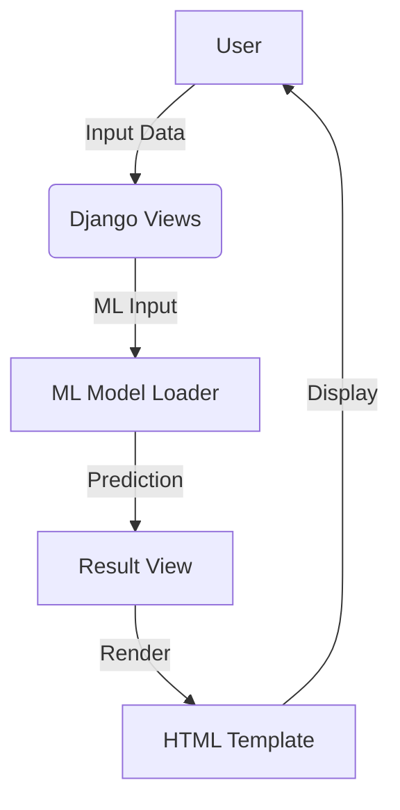

# Well Scan – Architecture Overview

## High-Level Architecture

```mermaid
flowchart TD
    subgraph Frontend
        TEMPLATES[HTML Templates] 
        CSS[CSS/Bootstrap] 
        JS[JavaScript]
    end
    subgraph Backend
        DJANGO[Django Framework]
        ORGANS[organs App]
        VIEWS[Django Views]
    end
    subgraph ML[Machine Learning]
        NOTEBOOKS[Jupyter Notebooks]
        MODELS[Trained Models (joblib)]
    end
    subgraph Data[Database]
        SQLITE[SQLite DB]
    end
    subgraph Static[Static & Media]
        STATIC[static/]
        UPLOADS[uploads/]
    end
    TEMPLATES -->|Rendered| DJANGO
    CSS --> TEMPLATES
    JS --> TEMPLATES
    DJANGO --> VIEWS
    VIEWS --> ORGANS
    ORGANS -->|Uses| MODELS
    NOTEBOOKS --> MODELS
    ORGANS --> SQLITE
    STATIC --> TEMPLATES
    UPLOADS --> ORGANS
```

## Data Flow Diagram



## Folder Structure

- `Health_Checker/` – Django project config
- `organs/` – Django app (views, models, ML integration)
- `Notebooks/` – Data science notebooks
- `savedModels/` – ML models
- `static/` – CSS, JS, images
- `templates/` – HTML templates

## Deployment
- Gunicorn and Whitenoise for production
- Vercel configuration for cloud deployment

## Extensibility
- Add new ML models by placing them in `savedModels/` and updating views/forms
- Add new pages by creating templates and updating `urls.py`
